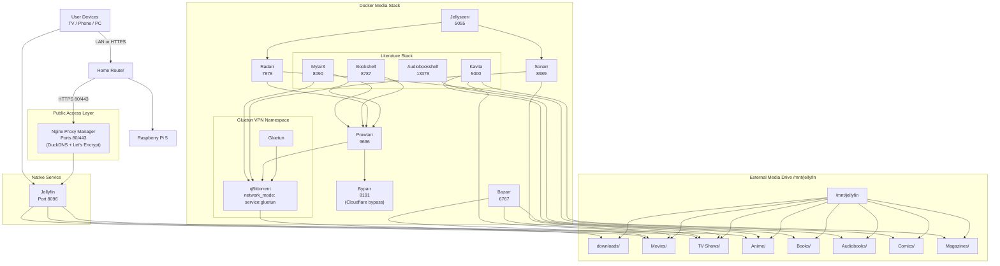

# Raspberry Pi Media Stack

> A fully automated, VPN-gated self-hosted media system running on a Raspberry Pi 5. Movies, TV, anime, books, comics, and audiobooks — searched, downloaded, organized, and served automatically.

[](LICENSE)
[](#hardware)
[](https://github.com/Derec58/raspberry-pi-media-stack/commits/main)
[](#stack)

---

## Table of Contents

- [Overview](#overview)
- [Stack](#stack)
- [Architecture](#architecture)
  - [Diagram](#architecture-diagram)
  - [Networking](#networking)
  - [Storage](#storage)
  - [Public Access](#public-access)
- [Getting Started](#getting-started)
  - [Prerequisites](#prerequisites)
  - [Deployment](#deployment)
- [Configuration](#configuration)
- [Literature Stack](#literature-stack)
- [Known Limitations](#known-limitations)
- [Lessons Learned](#lessons-learned)
- [Roadmap](#roadmap)
- [Acknowledgments](#acknowledgments)
- [License](#license)

---

## Overview

This repository documents my Raspberry Pi media automation stack. The goal was to build a reproducible, secure, and modular self-hosted system — and to learn everything required to do it properly.

My background is in **Product Design** with experience in HTML, CSS, Python, C++, and Java. Before this project I had no hands-on experience with systems administration, Docker networking, or infrastructure. The learning curve was steep and genuinely uncomfortable. Port conflicts, VPN routing, bind mount mismatches, and container dependency chains were all solved through research and trial and error.

The end result is a stack that automatically finds, downloads, organizes, and serves media — all routed through a VPN with zero manual intervention after initial setup.

**Hardware:**
- Raspberry Pi 5 (8GB RAM)
- 6TB external HDD mounted at `/mnt/jellyfin`

**Media served through:** Jellyfin (native systemd service, port 8096)

---

## Stack

All services run as Docker containers managed by Docker Compose, except Jellyfin which runs natively for hardware transcoding access.

| Service | Purpose | Port | Image |
|---|---|---|---|
| **Jellyfin** | Media server — streams to all devices | 8096 | native (systemd) |
| **Jellyseerr** | Request portal — users submit what to download | 5055 | `fallenbagel/jellyseerr` |
| **Sonarr** | TV show automation — monitors, downloads, organizes | 8989 | `linuxserver/sonarr` |
| **Radarr** | Movie automation — monitors, downloads, organizes | 7878 | `linuxserver/radarr` |
| **Prowlarr** | Indexer manager — feeds torrent sources to all *arr apps | 9696 | `linuxserver/prowlarr` |
| **Bazarr** | Subtitle automation — finds and syncs subtitles | 6767 | `linuxserver/bazarr` |
| **qBittorrent** | Torrent client — all traffic routed through Gluetun VPN | 8080 | `linuxserver/qbittorrent` |
| **Gluetun** | VPN gateway — enforces kill-switch for qBittorrent | — | `qmcgaw/gluetun` |
| **Byparr** | Cloudflare bypass — lets Prowlarr access protected indexers | 8191 | `thephaseless/byparr` |
| **Nginx Proxy Manager** | Reverse proxy — TLS termination and external routing | 80/443 | `jc21/nginx-proxy-manager` |
| **Bookshelf** | Ebook/audiobook automation (Readarr replacement) | 8787 | `pennydreadful/bookshelf` |
| **Mylar3** | Comics and manga automation | 8090 | `linuxserver/mylar3` |
| **Audiobookshelf** | Audiobook and podcast server with mobile app | 13378 | `advplyr/audiobookshelf` |
| **Kavita** | Ebook, comic, and manga reading server | 5000 | `jvmilazz0/kavita` |

> **Note:** Byparr runs under the container name `flaresolverr` so Prowlarr's proxy config requires no changes. It is the actively maintained replacement for FlareSolverr, which became non-functional in 2025.

---

## Architecture

### Architecture Diagram



---

### Networking

The most important networking decision in this stack is how qBittorrent is isolated inside Gluetun's network namespace:

```yaml
network_mode: "service:gluetun"
```

This means qBittorrent does not have its own network interface. It shares Gluetun's entirely. The result is a hard kill-switch: if the VPN tunnel drops for any reason, qBittorrent immediately loses internet access. There is no fallback to the bare home IP, and no configuration mistake that could accidentally expose torrent traffic.

Gluetun also sets `FIREWALL_OUTBOUND_SUBNETS=192.168.0.0/16`, which allows qBittorrent to communicate with other containers and the LAN while keeping all internet traffic inside the VPN tunnel.

All other services are LAN-restricted by default. Only ports 80 and 443 are forwarded through the router, handled by Nginx Proxy Manager.

Byparr (Cloudflare bypass) runs on port 8191 and is called automatically by Prowlarr when an indexer requires a Cloudflare challenge to be solved. It uses Camoufox (a Firefox-based anti-detection browser) instead of the stale Selenium/undetected-chromedriver approach used by its predecessor FlareSolverr.

---

### Storage

All media lives on a single 6TB external HDD mounted at `/mnt/jellyfin`.

```
/mnt/jellyfin/
├── downloads/
│   ├── books/
│   └── comics/
├── Movies/
├── TV Shows/
├── Anime/
├── Books/
├── Audiobooks/
├── Comics/
└── Magazines/
```

Media automation containers (Sonarr, Radarr, Bazarr, Bookshelf, Mylar3, qBittorrent) all bind the full drive root:

```
/mnt/jellyfin → /data
```

Binding the same root path across every container ensures that a file at `/data/downloads/file.mkv` in qBittorrent is the same inode as `/data/TV Shows/Show/file.mkv` in Sonarr — which is required for hardlinks to work. Hardlinks allow completed downloads to be "moved" to their final library location without copying data, saving significant time and disk I/O.

Reading and serving containers (Audiobookshelf, Kavita) bind individual subdirectories instead:

```
/mnt/jellyfin/Audiobooks → /audiobooks
/mnt/jellyfin/Books      → /ebooks       (Audiobookshelf)
/mnt/jellyfin/Books      → /books        (Kavita)
/mnt/jellyfin/Comics     → /comics
/mnt/jellyfin/Magazines  → /magazines
```

---

### Public Access

[DuckDNS](https://www.duckdns.org) provides a persistent hostname that updates automatically when the home IP changes. Nginx Proxy Manager handles TLS termination using Let's Encrypt certificates, runs in `network_mode: host` to bind ports 80 and 443 directly on the Pi, and routes external HTTPS traffic to Jellyfin internally.

```
Internet → Router (port forward 80/443) → Nginx Proxy Manager → Jellyfin:8096
```

Only Jellyfin is reachable from the internet. All automation services are LAN-only.

---

## Getting Started

### Prerequisites

- Raspberry Pi 5 (4GB minimum, 8GB recommended)
- 64-bit Raspberry Pi OS (Bookworm or later)
- External storage drive with sufficient capacity
- OpenVPN credentials from a VPN provider
- A [DuckDNS](https://www.duckdns.org) account (free) for remote access

### Deployment

#### 1. Update the system

```bash
sudo apt update && sudo apt upgrade -y
```

#### 2. Install Docker

```bash
curl -fsSL https://get.docker.com | sh
sudo usermod -aG docker $USER
```

Log out and back in, then verify:

```bash
docker --version
docker compose version
```

#### 3. Install Jellyfin

Jellyfin runs as a native systemd service rather than a container. This gives it direct access to the Pi's hardware for transcoding without the complexity of passing through GPU/NPU devices into Docker.

```bash
curl https://repo.jellyfin.org/install-debuntu.sh | sudo bash
sudo systemctl enable --now jellyfin
```

Jellyfin will be available at `http://<pi-ip>:8096`.

#### 4. Clone this repository

```bash
git clone https://github.com/YOUR_USERNAME/raspberry-pi-media-stack.git
cd raspberry-pi-media-stack
```

#### 5. Configure environment variables

```bash
cp .env.example .env
nano .env
```

See the [Configuration](#configuration) section for all available variables.

#### 6. Add VPN configuration

Download the `.ovpn` config file from your VPN provider and place it at:

```
vpn/custom.ovpn
```

Gluetun reads this file to establish the VPN tunnel. Without it, the container will not start and qBittorrent will have no network access.

#### 7. Mount storage

```bash
lsblk                               # identify your drive
sudo mkdir -p /mnt/jellyfin
sudo mount /dev/sdb1 /mnt/jellyfin  # replace sdb1 with your device
sudo chown -R 1000:1000 /mnt/jellyfin
```

Add an entry to `/etc/fstab` to remount automatically on reboot:

```
/dev/sdb1  /mnt/jellyfin  ext4  defaults,nofail  0  2
```

#### 8. Set up literature directories *(optional)*

If you plan to use the Literature Stack (Bookshelf, Mylar3, Audiobookshelf, Kavita), run the setup script before starting the stack. It creates the required media and download directories with correct ownership.

```bash
bash setup-literature.sh
```

#### 9. Start the stack

```bash
docker compose up -d
docker ps
```

All containers should reach `Up` status within 30–60 seconds. Gluetun and Kavita include healthchecks and may show `(health: starting)` briefly before settling.

---

## Configuration

Copy `.env.example` to `.env` and fill in your values. The `.env` file is excluded from version control via `.gitignore`.

| Variable | Description | Example |
|---|---|---|
| `PUID` | User ID for LinuxServer containers. Run `id` to find yours. | `1000` |
| `PGID` | Group ID for LinuxServer containers. | `1000` |
| `TZ` | Timezone for all containers. | `America/Los_Angeles` |
| `CG_OPENVPN_USER` | OpenVPN username from your VPN provider. | *(your credential)* |
| `CG_OPENVPN_PASS` | OpenVPN password from your VPN provider. | *(your credential)* |

> `PUID` and `PGID` control file ownership inside LinuxServer containers. If downloaded media is inaccessible to Jellyfin, a mismatch here is the most likely cause. Run `id` on the Pi to get the correct values for your user.

---

## Literature Stack

A second automation layer handles written and audio content. These services integrate with the same Prowlarr indexers and qBittorrent download client as the main stack.

**Bookshelf** *(port 8787)*
A community-maintained replacement for Readarr, which was officially retired in 2025. Handles automated ebook and audiobook acquisition. Uses Goodreads metadata via the `softcover` image tag. The `hardcover` tag is also available for higher-quality metadata from [Hardcover.app](https://hardcover.app).

**Mylar3** *(port 8090)*
The comics and manga equivalent of Sonarr/Radarr. Tracks series by issue, monitors for new releases, and automatically downloads via Prowlarr and qBittorrent.

**Audiobookshelf** *(port 13378)*
An audiobook and podcast server with first-party iOS and Android apps. Manages file permissions internally and does not use `PUID`/`PGID`.

**Kavita** *(port 5000)*
A unified reading server for ebooks, comics, manga, and magazines. Supports the OPDS protocol, which allows compatible e-reader apps (Panels, Chunky, KOReader, etc.) to browse and sync your library. Manages file permissions internally.

---

## Known Limitations

- **Single node** — no redundancy; if the Pi goes down, all services go down
- **No RAID** — a single drive failure means data loss
- **No off-site backup** — the library exists only on the local HDD
- **No monitoring** — no alerting if a container crashes or disk fills
- **No resource limits** — containers can compete for RAM/CPU during heavy activity (most relevant during active Byparr/Camoufox challenges)

---

## Lessons Learned

**Infrastructure requires systems thinking.**
Individual services are easy. Making them interact correctly — consistent paths, correct permissions, shared network namespaces — requires reasoning about the whole system at once.

**Debugging requires tracing interactions.**
The most frustrating issue in this build was downloads completing successfully but imports failing silently. The cause was inconsistent bind mount paths: qBittorrent wrote to `/data/downloads/file.mkv`, but Sonarr was configured to look for it at `/downloads/file.mkv`. Standardizing every container to bind `/mnt/jellyfin → /data` resolved it. The lesson is to follow a file's path across every container boundary before assuming the code is wrong.

**Security must be intentional.**
The VPN kill-switch via `network_mode: "service:gluetun"` did not happen accidentally — it was a deliberate architectural decision. Same for keeping automation services off the public internet. Security defaults in Docker are permissive; you have to choose restriction.

**Growth happens through discomfort.**
There were extended sessions where nothing worked and the path forward was unclear. Pushing through those moments is where the real learning happened.

---

## Roadmap

- [ ] Migrate Jellyfin into Docker (with hardware transcoding passthrough)
- [ ] Deploy on Proxmox for better VM/container separation
- [ ] Implement RAID or ZFS for drive redundancy
- [ ] Add Immich for photo/video library management
- [ ] Add Paperless-ngx for document management
- [ ] Add Home Assistant for home automation integration
- [ ] Add monitoring and alerting (Uptime Kuma or similar)
- [ ] Implement automated off-site backup

---

## Acknowledgments

Built on the shoulders of the open source community and the selfhosted ecosystem. Special thanks to the LinuxServer.io team, the \*arr project maintainers, the Gluetun project, and the communities at [r/selfhosted](https://reddit.com/r/selfhosted) and [r/homelab](https://reddit.com/r/homelab).

---

## License

MIT License — free to use, adapt, and share for personal and educational purposes.
