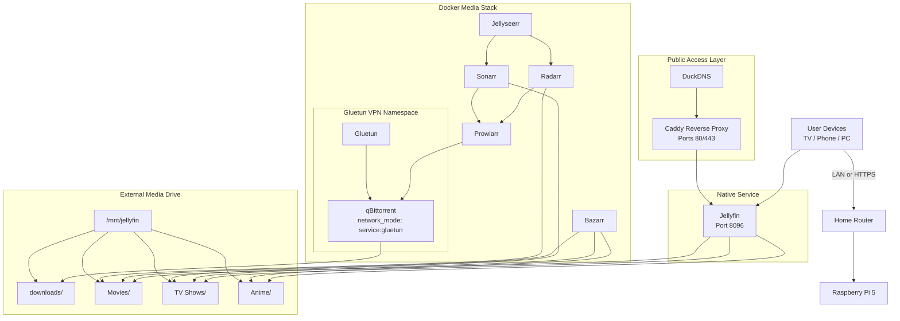

# Raspberry Pi Media Stack (Docker + Jellyfin)

This repository documents my Raspberry Pi media automation stack built using Docker, a VPN gateway, and Jellyfin on a Raspberry Pi that I purchased on a whim.

The goal of this project is to create a reproducible, secure, and modular self hosted media system while continuing to learn and enjoy the process.

---

<br>

# Table of Contents

- [Project Background](#project-background)
- [System Architecture Overview](#system-architecture-overview)
- [Architecture Diagram](#architecture-diagram)
- [Networking Architecture](#networking-architecture-deep-dive)
- [Public Access Configuration](#public-access-configuration-duckdns--caddy)
- [Storage Architecture](#storage-architecture-deep)
- [Deep Debugging Example](#deep-debugging-example)
- [Rebuild From Scratch](#rebuild-from-scratch-full-deployment-guide)
- [Known Limitations](#known-limitations)
- [Failure Modes & Risk Awareness](#failure-modes--risk-awareness)
- [Operational Awareness](#operational-awareness)
- [Tech Stack](#tech-stack)
- [Lessons Learned](#lessons-learned)
- [Future Roadmap](#future-roadmap)
- [Acknowledgments](#acknowledgments)
- [License](#license)

---

<br>

## Project Background

This project represents my first deep dive into self hosted infrastructure, containerization, and service orchestration.

My professional background is in **Product Design**, with hands on experience in HTML, CSS, Python, C++, and Java (Processing). But, I had no experience in systems administration, networking, virtualization, or IT infrastructure prior to putting this stack together. Other than some limited residential IT support I do at home for myself and others.

At the beginning, the objective was simple: set up a personal media server.

Very quickly, that objective expanded into unfamiliar territory. I found myself learning Docker networking, VPN routing, firewall behavior, volume mappings, container dependencies, Linux services, and infrastructure documentation. I initially assumed this would be a straightforward process where I could follow a guide and execute a few commands. That assumption did not last long.

There were moments of confusion, extended debugging sessions, and periods where I stepped away to reset. Even setting up the Raspberry Pi for the first time required patience and significant trial and error. Understanding why containers could not access shared directories required deeper research and troubleshooting. Diagnosing port conflicts, VPN routing behavior, and Docker networking patterns required thinking in ways that were different from front end or design workflows.

This project challenged me technically in ways I had not previously experienced.

At the same time, it reinforced something important. I genuinely enjoy building systems. I have wanted to create a self hosted media environment for years after seeing friends build their own servers. Completing this stack represents a meaningful milestone that reflects persistence, discipline, and measurable technical growth.

Most importantly, I learned a tremendous amount and genuinely enjoyed building it.

---

<br>

## System Architecture Overview

The stack operates across two layers:

1. Native service layer (Jellyfin)
2. Docker-managed automation layer

Hardware:
- Raspberry Pi 5 (8GB RAM)
- 6TB external HDD mounted at `/mnt/jellyfin`

Logical flow:

User → Jellyfin → Media Storage  
User Request → Jellyseerr → Sonarr/Radarr → Prowlarr → qBittorrent → Storage → Jellyfin

Each service has a clearly defined responsibility.

---

<br>

## Architecture Diagram



---

<br>

## Networking Architecture (Deep Dive)

Docker normally assigns containers individual network namespaces.

However:

```
network_mode: "service:gluetun"
```

This forces qBittorrent to share Gluetun’s network stack.

Result:

- qBittorrent cannot access the internet without VPN
- If VPN drops, torrent traffic stops
- No IP leakage occurs
- This is fail-closed enforcement

Only ports 80 and 443 are exposed publicly.

Automation services remain LAN-restricted.

---

<br>

## Public Access Configuration (DuckDNS + Caddy)

DuckDNS:
- Provides persistent subdomain
- Updates dynamic IP automatically

Caddy:
- Issues HTTPS certificates via Let's Encrypt
- Handles TLS termination
- Forwards traffic internally to Jellyfin

Flow:

Internet  
↓  
Router (80/443)  
↓  
Caddy  
↓  
Jellyfin:8096  

Only Jellyfin is public.

---

<br>

## Storage Architecture (Deep)

All media stored at:

```
/mnt/jellyfin
```

Structure:

```
downloads/
Movies/
TV Shows/
Anime/
```

All containers bind:

```
/mnt/jellyfin → /data
```

This prevents:

- Path mismatches
- Duplicate storage
- Hardlink failures
- Import issues

Volume consistency is critical for automation reliability.

---

<br>

## Deep Debugging Example

Media downloads succeeded but imports failed.

Cause:
Inconsistent container bind mounts created path mismatches.

Fix:
Standardized `/mnt/jellyfin → /data` across all services.

Lesson:
System health requires tracing interactions between containers.

---

<br>

## Rebuild From Scratch (Full Deployment Guide)

### 1. Install Raspberry Pi OS (64-bit)

```bash
sudo apt update
sudo apt upgrade -y
```

---

### 2. Install Docker

```bash
curl -fsSL https://get.docker.com | sh
sudo usermod -aG docker $USER
```

Log out/in.

Verify:

```bash
docker --version
docker compose version
```

---

### 3. Clone Repository

```bash
git clone https://github.com/YOUR_USERNAME/raspberry-pi-media-stack.git
cd raspberry-pi-media-stack
```

---

### 4. Configure .env

```bash
cp .env.example .env
nano .env
```

Set:
- PUID (match `id`)
- PGID
- TZ
- VPN credentials

---

### 5. Add VPN Configuration

Download `.ovpn` file from VPN provider.

Place inside:

```
vpn/custom.ovpn
```

This file contains:
- VPN server endpoints
- Encryption settings
- Certificate data

Without this, Gluetun cannot connect.

---

### 6. Mount Storage

```bash
lsblk
sudo mkdir -p /mnt/jellyfin
sudo mount /dev/sdb1 /mnt/jellyfin
```

Add to `/etc/fstab`.

Set ownership:

```bash
sudo chown -R 1000:1000 /mnt/jellyfin
```

---

### 7. Start Stack

```bash
docker compose up -d
```

Verify:

```bash
docker ps
```

---

<br>

## Known Limitations

- Single node
- No RAID
- No off-site backup
- No monitoring
- No container resource limits

---

<br>

## Failure Modes & Risk Awareness

Risks:
- HDD failure
- VPN crash
- Router misconfiguration
- TLS expiration

Future mitigation:
- RAID/ZFS
- Monitoring
- Backup replication

---

<br>

## Operational Awareness

Hardware:
- Raspberry Pi 5 (8GB RAM)
- 6TB HDD

Add real metrics here if desired.

---

<br>

## Tech Stack

Hardware:
- Raspberry Pi 5
- 6TB HDD

Software:
- Raspberry Pi OS
- Docker
- Docker Compose
- Jellyfin
- Sonarr
- Radarr
- Prowlarr
- Bazarr
- Jellyseerr
- qBittorrent
- Gluetun
- Caddy
- DuckDNS

---

<br>

## Lessons Learned

Infrastructure requires systems thinking.

Debugging requires tracing interactions.

Security must be intentional.

Growth happens through discomfort.

---

<br>

## Future Roadmap

- Migrate Jellyfin to Docker
- Deploy Proxmox
- Implement RAID/ZFS
- Add Immich, Paperless-ngx, Home Assistant
- Add monitoring & backup automation

---

<br>

## Acknowledgments

This project stands on the support of peers and the open source community.

---

<br>

## License

MIT License — educational and homelab use.
